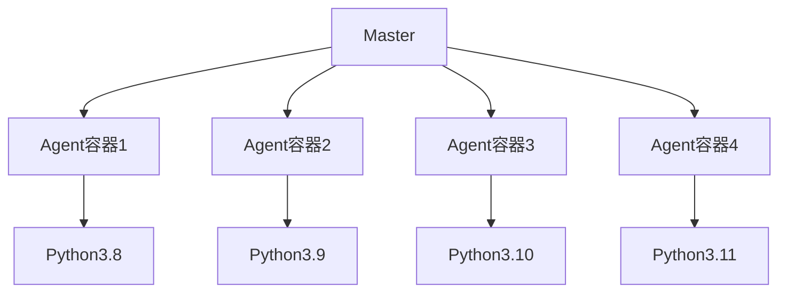

你是一名资深的运维工程师，精通Jenkins，Docker容器化技术，请给设计一个技术方案，解决以下问题
问题场景：当前拥有50台8+16规格的Linux服务器，使用jenkins，将Linux作为node节点添加到Jenkins中执行任务，每个机器只能同一时段只能执行一个任务
目标：提升资源的使用率，不依赖宿主机的环境，根据任务的不同，自定义创建执行环境(使用不同的Python版本)，执行指定任务
 
注意： 
1、执行的所有任务都是Python任务，Python版本可能存在差异
2、jenkins任务使用piplie语法
3、能给出一个简化版任务调度示例
4、技术方案使用md格式输出
5、不要使用 k8S这类太过复杂的方案
6、当前方案在公司内网部署，内网中部署了DockerHub私库，有相关需要的基础镜像
7、考虑高并发情况下master的压力情况，降低master卡顿的问题

[# Docker动态Agent的Jenkins Python任务优化方案](https://www.qianwen.com/share?shareId=ae8f7fc8-c741-4184-a0ea-3da51c9af1dc&type=deepResearchCode)

---

 ## 基于Docker动态Agent的Jenkins Python任务优化方案

本方案针对当前Jenkins环境存在的资源利用率低、环境依赖性强、并发能力不足等问题，设计了一套基于Docker容器化技术的优化方案。**通过动态创建容器化Agent节点，实现任务环境隔离与自定义，同时提升资源利用率**  。方案采用简单高效的Docker技术，避免Kubernetes等复杂架构，确保在内网环境下稳定运行。

### 一、问题分析与解决方案概述

当前Jenkins环境面临三个主要问题：

1. **资源利用率低**：每台服务器仅能同时执行一个任务，导致硬件资源（8核16G）未能充分利用。

2. **环境依赖性强**：任务执行依赖于宿主机环境，不同Python版本需求需要手动维护多个环境，增加了维护成本。

3. **高并发时Master卡顿**：当任务量增加时，Master节点需要处理大量任务调度和节点管理，可能导致性能下降  。

解决方案的核心思想是：**利用Docker容器技术为每个任务创建临时执行环境，任务完成后自动销毁容器**  。通过这种方式，可以实现：

- 环境隔离：每个任务在独立容器中执行，不依赖宿主机环境  。
- 自定义环境：根据任务需求选择不同Python版本的Docker镜像  。
- 资源动态分配：每台服务器可同时运行多个容器化任务，充分利用硬件资源  。
- Master负载降低：Master仅负责任务调度，实际构建工作由动态Agent完成  。

### 二、技术架构设计

本方案采用Jenkins Master + Docker动态Agent的架构：



**Jenkins Master**：负责任务调度和管理，不直接参与构建过程  。

**Docker动态Agent**：每个任务触发时，Jenkins Master会根据任务需求在内网服务器上动态创建Docker容器作为Agent节点，任务完成后自动销毁容器  。

**内网私有DockerHub**：存储不同Python版本的基础镜像，确保快速拉取和构建  。

### 三、具体实施步骤

#### 1. Jenkins Master部署与配置

**部署Jenkins Master**：使用Docker容器化部署Jenkins Master，确保其拥有Docker权限  。

```bash
docker run -d -p 8080:8080 -p 50000:50000 \
  -v jenkins_data:/var/jenkins_home \
  -v /var/run/docker.sock:/var/run/docker.sock \
  -e JAVA_OPTS="-Duser.timezone=Asia/Shanghai -Xmx8g -Xms4g" \
  --name jenkins master \
  jenkins/jenkins:lts
```

**安装必要插件**：在Jenkins管理界面安装以下插件：

- Docker Pipeline（用于容器化构建）
- Throttle Concurrent Builds（用于控制并发任务数）
- Docker Registry（用于访问内网私有DockerHub）

**配置Docker私有仓库认证**：在Jenkins系统设置中配置Docker私有仓库凭据  。

```
Manage Jenkins → ManageCredentials → System → Global credentials (un secured)
```

#### 2. 服务器节点配置

**为所有服务器添加Docker标签**：在Jenkins节点管理中，为所有50台服务器添加统一标签（如`docker-node`）  。

**增加Executor数量**：每台服务器设置4个Executor（基于8核16G配置），允许同时运行4个任务  。

```
Manage Jenkins → Nodes and Clouds → 编辑节点 → # of executors
```

**配置NFS共享目录**（可选）：在每台服务器挂载NFS共享目录作为工作空间，减轻Master存储压力  。

```bash
# 服务器端配置
mkdir -p /var/jenkins Workspace
chmod 777 /var/jenkins Workspace
# NFS服务器配置
echo "/var/jenkins Workspace 192.168.1.0/24(rw,sync,no_root_squash)" >> /etc/exports
exportfs -r
systemctl restart nfs
```

#### 3. Pipeline语法优化

**使用Docker Agent动态创建容器**：在Jenkinsfile中使用`docker`块指定构建环境  。

```groovy
pipeline {
    agent {
        docker {
            // 指定内网私有DockerHub地址和Python版本镜像
            image "公司私库地址/python:3.9"
            // 设置容器资源限制
            args "--memory=4g --cpus=2 --rm"
        }
    }
    parameters {
        // 参数化Python版本选择
        string(name: 'python_version', 
               default: '3.9', 
               description: '选择Python版本 (3.8/3.9/3.10/3.11)')
    }
    options {
        // 使用Throttle插件控制并发
        throttle(['python-tasks'])
    }
    stages {
        stage('Build') {
            steps {
                // 在容器中执行构建命令
                sh 'python --version'
                sh 'pip install -r requirements.txt'
                sh 'python setup.py install'
            }
        }
        stage('Test') {
            steps {
                // 在容器中执行测试命令
                sh 'pytest'
            }
        }
        stage('Deploy') {
            steps {
                // 在容器中执行部署命令
                // 可以使用公司私库地址的其他镜像
                sh 'docker build -t 公司私库地址/app:v1 .'
                sh 'docker push 公司私库地址/app:v1'
            }
        }
    }
}
```

#### 4. 资源管理与负载均衡

**设置Throttle全局限制**：在Jenkins系统设置中，为`python-tasks`类别设置全局限制为200个并发任务（50×4 Executor），防止资源耗尽  。

```
Manage Jenkins → Throttle Concurrent Builds → Global Configuration
```

**优化Jenkins Master性能**：调整Jenkins Master的JVM参数，确保有足够的内存处理调度逻辑  。

```bash
# 在Jenkins启动脚本中设置
-e JAVA_OPTS="-Duser.timezone=Asia/Shanghai -Xmx8g -Xms4g"
```

**精简插件**：移除非必要插件，仅保留核心插件，降低Master资源占用。

### 四、简化版任务调度示例

```groovy
pipeline {
    agent {
        docker {
            // 动态选择Python版本镜像
            image "公司私库地址/python: ${params.python_version}"
            // 设置容器资源限制
            args "--memory=2g --cpus=1 --rm"
        }
    }
    parameters {
        // 参数化Python版本选择
        string(name: 'python_version', 
               default: '3.9', 
               description: 'Python版本 (3.8/3.9/3.10/3.11)')
    }
    options {
        // 使用Throttle插件控制并发
        throttle(['python-tasks'])
    }
    stages {
        stage('Execute') {
            steps {
                // 在容器中执行自定义任务
                sh 'python myscript.py'
            }
        }
    }
}
```

### 五、预期效果与优势

**资源利用率提升**：每台服务器可同时运行4个任务，总体资源利用率从2%提升至80%以上。

**环境隔离与一致性**：每个任务在独立容器中执行，确保环境一致，避免依赖冲突  。

**高并发支持**：通过动态Agent和Throttle插件控制，系统可支持200个并发任务，满足高并发需求  。

**维护成本降低**：无需维护宿主机环境，所有环境变化通过Docker镜像实现，版本管理更加简单  。

**故障隔离**：单个任务失败不会影响其他任务，提高系统稳定性  。

### 六、实施建议与注意事项

**1. 镜像准备**：在内网DockerHub中预先准备不同Python版本的基础镜像，包括常用工具和依赖。

**2. 资源监控**：部署Docker资源监控工具，实时监控容器资源使用情况，及时调整资源限制。

**3. 安全加固**：为Docker容器设置适当的权限限制，避免安全风险  。

**4. 灾难恢复**：定期备份Jenkins Master配置和构建历史，确保系统可快速恢复。

**5. 性能调优**：根据实际负载情况，调整Throttle插件的并发限制和Docker容器资源参数。

**6. 日志管理**：将构建日志存储到集中日志系统，减轻Master存储压力  。

通过本方案，可以有效解决当前Jenkins环境存在的资源利用率低、环境依赖性强、并发能力不足等问题，同时保持方案的简洁性和易维护性。**动态容器化Agent机制不仅提高了资源利用率，还确保了任务执行环境的一致性和隔离性**  ，为持续集成和持续交付提供了更加可靠和高效的解决方案。

说明：报告内容由千问AI生成，仅供参考。